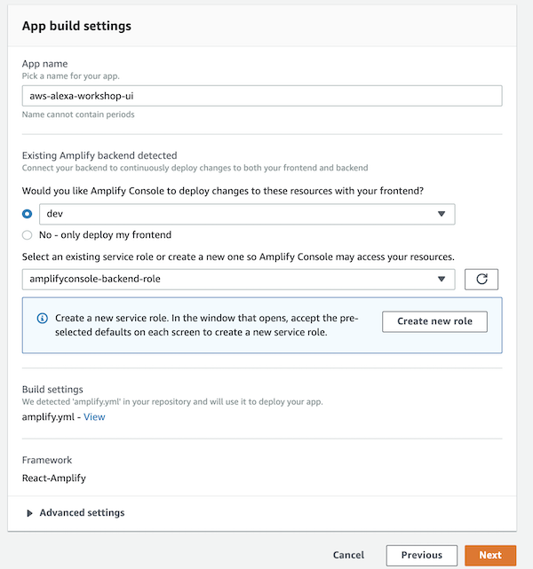
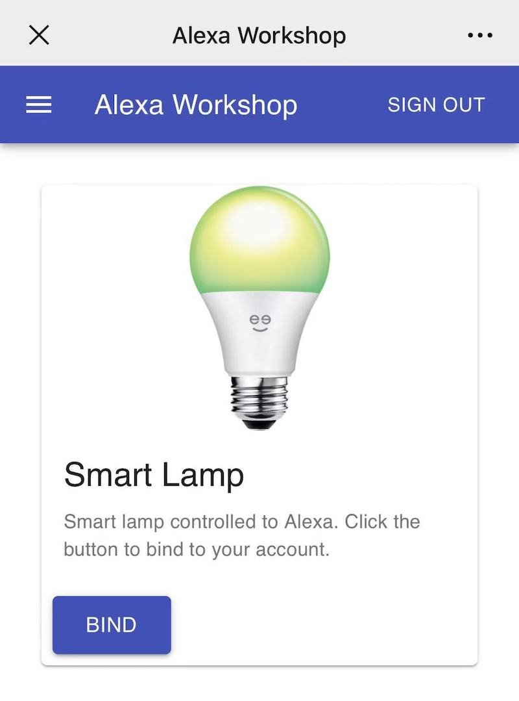

# AWS Alexa Workshop UI

This web application is part of [AWS Alexa Workshop Smart Home](https://github.com/lab798/aws-alexa-workshop-smarthome). It is used to bind devices to users in [Amazon Cognito User Pools](https://docs.aws.amazon.com/cognito/latest/developerguide/cognito-user-identity-pools.html).

The web application is built by [AWS Amplify](https://aws-amplify.github.io/). The following is the architect:

When bind a device to a user, it will invoke the API and create an record in DynamoDB. When 
your device cloud receive a [Alexa.Discovery](https://developer.amazon.com/docs/device-apis/alexa-discovery.html)
directive, your Lambda should retrieve from this DynamoDB table and return to Alexa.

## How to Run

This is a [modern web application](https://docs.aws.amazon.com/amplify/latest/userguide/welcome.html#what-are-modern-web-applications),
thus the easiest way for deployment is [AWS Amplify Console](https://docs.aws.amazon.com/amplify/latest/userguide/welcome.html).

### Deployment

1. Git push your code to **GitHub**, **BitBucket**, **GitLab** or **CodeCommit**. You can fork this repo on GitHub.
1. Open **Amplify Console** in AWS Console, click **Get started** in **Deploy** session

1. Choose the Git repo provider and select **Continue**
1. Choose the repo and branch, select **Next**

1. Input **App name**
1. Create a new environment, input the **environment name** of leave it as default
1. Select or create a new service role, and click **Next**

1. Click **Save and deploy**

Wait for the deployment to be finished. You will be see the URL for the web application.

### Run the Web

Open `http://<amplify-app-link>/?deviceId=xxxxxx`.

You will asked to registered an account if you don't have any. 
In this application, you should input **email** address as your username.

Once you login, the browser will be navigated the device binding page. Click
the **Bind** button to link the device to your account.

## Development

You will ONLY need to run this if you would like to develop locally.

In this application, **Yarn** and **node.js** are used to build the application. 
Please install the [Yarn](https://yarnpkg.com/en/) and [node.js](https://nodejs.org/en/). 
The easiest way to install nodejs is [NVM](https://github.com/nvm-sh/nvm).

The backend is provisioned via [AWS Amplify CLI](https://github.com/aws-amplify/amplify-cli#install-the-cli). 
The easiest way to install is via **npm**. If you install nodejs via NVM, it will come with **npm**.

1. Init the backend. Run `amplify init`, enter **dev** for environment name
1. Choose your **default editor** and **AWS profile**. Wait for the initialization finished

1. Run `amplify push` and type **Yes** when asked to confirm
1. Click **Enter** button to keep the all the rest default settings

1. Run `yarn install` to install dependencies
1. Run `yarn start` to start the web application

Open [http://localhost:3000/?deviceId=xxxxxxxx](http://localhost:3000/?deviceId=xxxxxxxx) to view it in the browser.

If you are the first time to run the web application. You should click the **Create account** button to create an account.
